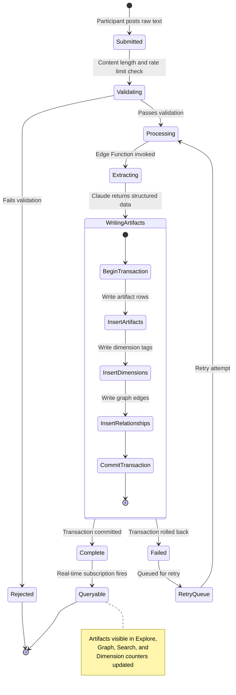

# Backend Engineer -- Visual: Contribution Data Flow

The state transitions and data operations for a single contribution, from submission through extraction to queryable knowledge graph state.

```mermaid
stateDiagram-v2
    [*] --> Submitted: Participant posts raw text
    Submitted --> Validating: Content length and rate limit check
    Validating --> Rejected: Fails validation
    Validating --> Processing: Passes validation
    Processing --> Extracting: Edge Function invoked
    Extracting --> WritingArtifacts: Claude returns structured data

    state WritingArtifacts {
        [*] --> BeginTransaction
        BeginTransaction --> InsertArtifacts: Write artifact rows
        InsertArtifacts --> InsertDimensions: Write dimension tags
        InsertDimensions --> InsertRelationships: Write graph edges
        InsertRelationships --> CommitTransaction
        CommitTransaction --> [*]
    }

    WritingArtifacts --> Complete: Transaction committed
    WritingArtifacts --> Failed: Transaction rolled back
    Complete --> Queryable: Real-time subscription fires
    Failed --> RetryQueue: Queued for retry
    RetryQueue --> Processing: Retry attempt
    Rejected --> [*]
    Queryable --> [*]

    note right of Queryable
        Artifacts visible in Explore,
        Graph, Search, and
        Dimension counters updated
    end note
```
