# commons.id/app — Seven-Layer Architecture

A holistic view of the Information and Communications Commons mapped to Techne's Seven Progressive Design Patterns. Each layer presupposes the layers beneath it. The platform decomposes into these layers; any convergence event recomposes from them.

```mermaid
graph TB
    subgraph L7["VIEW — Layer 7: Presentation"]
        direction LR
        V1["commons.id/app<br/>React SPA"]
        V2["Explore<br/>2-D / 3-D Graph"]
        V3["Dimensions<br/>e/H-LAM/T/S"]
        V4["Live Dashboard<br/>Projection View"]
        V5["Contribute<br/>Natural Language Input"]
        V6["Graph Replay<br/>Temporal Slider"]
    end

    subgraph L6["CONSTRAINT — Layer 6: Rules"]
        direction LR
        C1["RLS Policies<br/>Public Read / Auth Write"]
        C2["Rate Limiting<br/>10/hr per participant"]
        C3["Content Validation<br/>20-10,000 chars"]
        C4["Chain Immutability<br/>No mutation after INSERT"]
        C5["Steward Bypass<br/>Countdown Gate"]
        C6["Agent Reputation<br/>Throttle at 0.3"]
    end

    subgraph L5["FLOW — Layer 5: Value Movement"]
        direction LR
        F1["Contribution Pipeline<br/>Submit > Extract > Graph"]
        F2["Make.com Webhooks<br/>Transcript / Artifact / Observation"]
        F3["Coordination Signals<br/>Interest > Match > Connect"]
        F4["Agent API<br/>Contribute / Message / React"]
        F5["Profile Extraction<br/>Auth > Claude > Participant"]
    end

    subgraph L4["EVENT — Layer 4: What Happened"]
        direction LR
        E1["Convergence Chain<br/>Append-only Hash Chain"]
        E2["Event Log<br/>12 event types"]
        E3["Contributions<br/>seq / chain_hash / parent_hash"]
        E4["Realtime Subscriptions<br/>Supabase Channels"]
        E5["State Transitions<br/>seed > discussed > active > completed"]
    end

    subgraph L3["RELATIONSHIP — Layer 3: Connections"]
        direction LR
        R1["Artifact Relationships<br/>8 types: builds_on, extends,<br/>contradicts, supports..."]
        R2["Participant Connections<br/>Convergence-scoped"]
        R3["Artifact-Participant<br/>author / contributor /<br/>steward / interested"]
        R4["Artifact-Session<br/>discussed_in / emerged_from"]
        R5["Coordination Graph<br/>Participant > Artifact edges"]
    end

    subgraph L2["STATE — Layer 2: Attributes"]
        direction LR
        S1["Artifacts<br/>title, summary, type,<br/>state, REA role"]
        S2["Participants<br/>name, bio, skills,<br/>offerings, interests"]
        S3["Convergences<br/>theme, dates, dimensions,<br/>steward_ids, opens_at"]
        S4["Sessions<br/>track, speakers, schedule,<br/>Chatham House flag"]
        S5["Tags + Dimensions<br/>7 dimensions with weights"]
    end

    subgraph L1["IDENTITY — Layer 1: Naming"]
        direction LR
        I1["commons.id<br/>Domain IS the identity layer"]
        I2["Namespace<br/>/a/ artifacts  /p/ participants<br/>/c/ convergences  /t/ tents"]
        I3["UUIDs<br/>Every entity globally unique"]
        I4["REA Grammar<br/>Resource / Event / Agent"]
        I5["Auth Identity<br/>Supabase auth.uid()<br/>linked to participant"]
    end

    L7 --> L6
    L6 --> L5
    L5 --> L4
    L4 --> L3
    L3 --> L2
    L2 --> L1

    subgraph QA["CROSS-CUTTING: Quality + Observability"]
        direction LR
        Q1["Client Error Logging"]
        Q2["Extraction Health Metrics"]
        Q3["Chain Verification<br/>verify_merkle_chain()"]
        Q4["Search<br/>Full-text + GIN indexes"]
    end

    QA -.- L7
    QA -.- L4
    QA -.- L2

    subgraph INFRA["INFRASTRUCTURE"]
        direction LR
        X1["Supabase<br/>Postgres + Auth + Realtime<br/>+ Edge Functions + Storage"]
        X2["Make.com<br/>Workflow Automation"]
        X3["Claude API<br/>Extraction Intelligence"]
        X4["GitHub Pages<br/>Static Hosting"]
    end

    L1 --> INFRA

    classDef layer7 fill:#7c3aed,stroke:#6d28d9,color:#fff
    classDef layer6 fill:#dc2626,stroke:#b91c1c,color:#fff
    classDef layer5 fill:#ea580c,stroke:#c2410c,color:#fff
    classDef layer4 fill:#ca8a04,stroke:#a16207,color:#fff
    classDef layer3 fill:#16a34a,stroke:#15803d,color:#fff
    classDef layer2 fill:#0284c7,stroke:#0369a1,color:#fff
    classDef layer1 fill:#4f46e5,stroke:#4338ca,color:#fff
    classDef qa fill:#525252,stroke:#404040,color:#fff
    classDef infra fill:#1a1a1a,stroke:#c3fd50,color:#c3fd50

    class V1,V2,V3,V4,V5,V6 layer7
    class C1,C2,C3,C4,C5,C6 layer6
    class F1,F2,F3,F4,F5 layer5
    class E1,E2,E3,E4,E5 layer4
    class R1,R2,R3,R4,R5 layer3
    class S1,S2,S3,S4,S5 layer2
    class I1,I2,I3,I4,I5 layer1
    class Q1,Q2,Q3,Q4 qa
    class X1,X2,X3,X4 infra
```

## Reading the Diagram

**Bottom-up composition:** Each layer builds on the one beneath it. You cannot present Views (Layer 7) of Events (Layer 4) that reference Relationships (Layer 3) between entities that have no Identity (Layer 1).

**Top-down decomposition:** Any feature request decomposes into the layers it touches. "Show me who's interested in the same ideas" requires View (7) + Constraint (6: auth) + Flow (5: signal routing) + Event (4: signal logged) + Relationship (3: participant-artifact edge) + State (2: participant attributes) + Identity (1: participant UUID).

**White-label implication:** Every layer is convergence-scoped. Swap the convergence record (Layer 2) and its theme/dimensions, and the entire stack serves a different event. The patterns are the product. The convergence is the configuration.

## The Three REA Roles Across All Layers

| REA Role | What it represents | Example in commons.id |
|----------|-------------------|----------------------|
| **Resource** | Stock of capacity | An idea, a skill, a pattern |
| **Event** | Transformation | A contribution, a commitment, a session |
| **Agent** | Participant with agency | A person, an AI agent, the collective |

REA is not a layer — it is the grammatical backbone that gives every layer its semantic coherence. An artifact at Layer 2 has a REA role. A relationship at Layer 3 connects REA-typed entities. An event at Layer 4 records a REA transformation. The grammar composes across layers because it was designed to.
