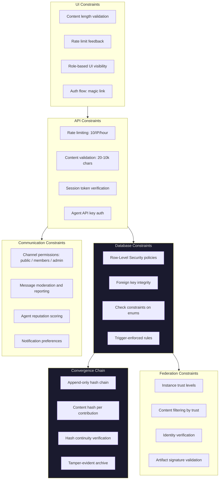

# Compliance and Security Engineer -- Visual: Defense in Depth Model

The layered security architecture of commons.id, showing how constraints are enforced at every level from database to UI, with the Convergence Chain providing cryptographic integrity.

