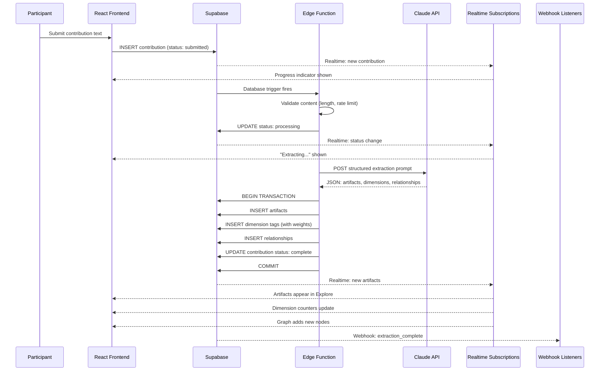

# Event Systems Engineer -- Visual: Extraction Pipeline Sequence

The event sequence for a single contribution, from participant submission through Claude extraction to real-time client notification.

