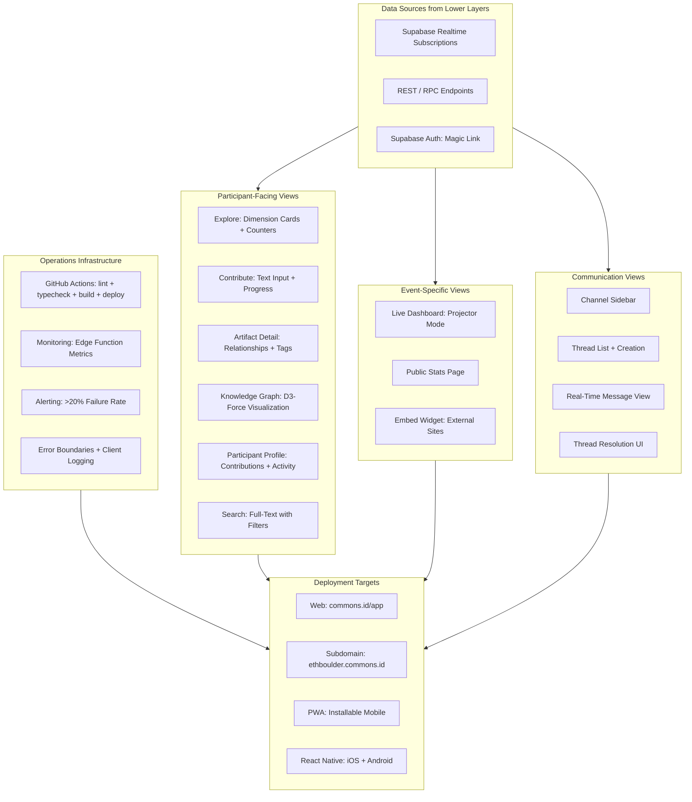

# Frontend and DevOps Engineer -- Visual: Deployment and View Architecture

The dual nature of Layer 7: the participant-facing views and the operations infrastructure that keeps them running.

```mermaid
graph TB
    subgraph PARTICIPANT_VIEWS["Participant-Facing Views"]
        EXPLORE[Explore: Dimension Cards + Counters]
        CONTRIBUTE[Contribute: Text Input + Progress]
        DETAIL[Artifact Detail: Relationships + Tags]
        GRAPH[Knowledge Graph: D3-Force Visualization]
        PROFILE[Participant Profile: Contributions + Activity]
        SEARCH[Search: Full-Text with Filters]
    end

    subgraph EVENT_VIEWS["Event-Specific Views"]
        DASHBOARD[Live Dashboard: Projector Mode]
        STATS[Public Stats Page]
        EMBED[Embed Widget: External Sites]
    end

    subgraph COMM_VIEWS["Communication Views"]
        CHANNELS[Channel Sidebar]
        THREADS[Thread List + Creation]
        MESSAGES[Real-Time Message View]
        RESOLVE[Thread Resolution UI]
    end

    subgraph INFRA["Operations Infrastructure"]
        CICD[GitHub Actions: lint + typecheck + build + deploy]
        MONITOR[Monitoring: Edge Function Metrics]
        ALERTS[Alerting: >20% Failure Rate]
        ERRORS[Error Boundaries + Client Logging]
    end

    subgraph DEPLOYMENT["Deployment Targets"]
        WEB[Web: commons.id/app]
        SUBDOMAIN[Subdomain: ethboulder.commons.id]
        PWA[PWA: Installable Mobile]
        NATIVE[React Native: iOS + Android]
    end

    subgraph DATA_SOURCES["Data Sources from Lower Layers"]
        RT[Supabase Realtime Subscriptions]
        API[REST / RPC Endpoints]
        AUTH[Supabase Auth: Magic Link]
    end

    DATA_SOURCES --> PARTICIPANT_VIEWS
    DATA_SOURCES --> EVENT_VIEWS
    DATA_SOURCES --> COMM_VIEWS
    INFRA --> DEPLOYMENT
    PARTICIPANT_VIEWS --> DEPLOYMENT
    EVENT_VIEWS --> DEPLOYMENT
    COMM_VIEWS --> DEPLOYMENT
```
