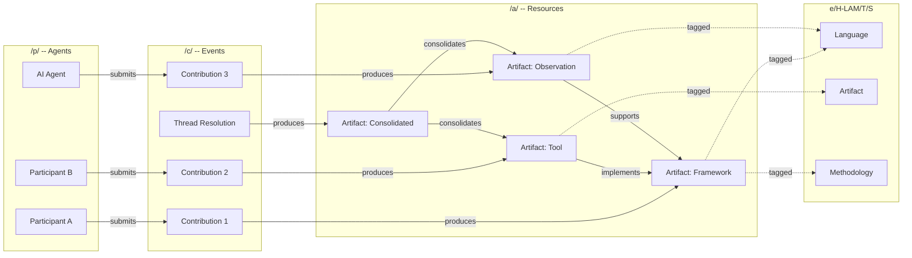

# Integration Engineer -- Visual: REA Ontology Traversal Graph

The relationship topology of commons.id, showing how REA entities (Agent, Event, Resource) connect across namespaces and how traversal paths enable the knowledge graph.

