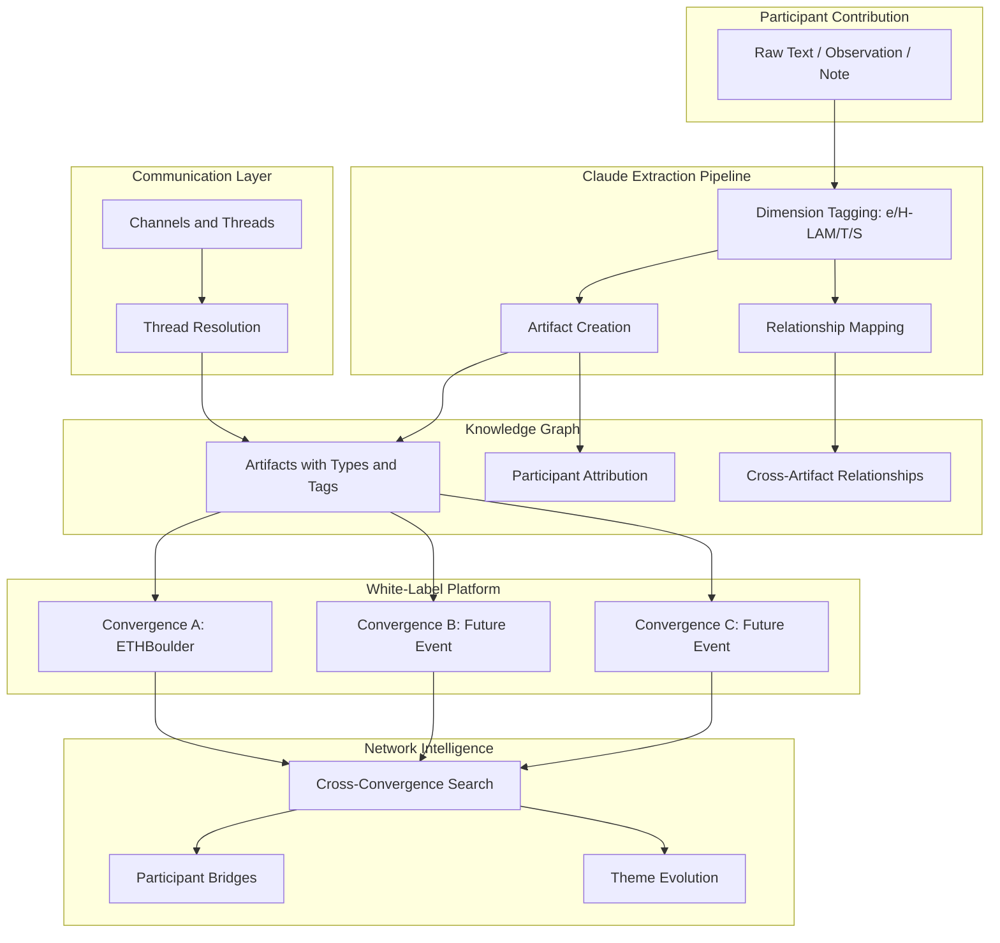

# Product Engineer -- Visual: commons.id Value Flow

The product value chain from raw contribution to platform network effect, showing how individual participant actions compound into cross-convergence intelligence.

