# QA and Test Engineer -- Visual: Test Pyramid Mapped to Pattern Stack

The testing strategy for commons.id, showing how the test pyramid (unit, integration, end-to-end) maps to the Seven Progressive Design Patterns.

```mermaid
graph TB
    subgraph E2E["End-to-End Tests (few, high-value)"]
        E2E1[Contribute text and verify artifact in Explore]
        E2E2[Thread resolution creates knowledge graph artifact]
        E2E3[Cross-convergence search returns scoped results]
        E2E4[Agent API contribute and verify extraction]
    end

    subgraph INTEGRATION["Integration Tests (moderate)"]
        INT_17[L1-L2: Schema creates valid tables with correct constraints]
        INT_23[L2-L3: Queries return correctly typed REA entities]
        INT_34[L3-L4: Extraction event produces linked artifacts]
        INT_45[L4-L5: Thread resolution workflow completes end-to-end]
        INT_56[L5-L6: Rate limits and RLS enforce during workflows]
        INT_67[L6-L7: Auth flow renders correct UI per role]
    end

    subgraph UNIT["Unit Tests (many, fast)"]
        U_L1[L1: Dimension enum validation]
        U_L1b[L1: Namespace path generation]
        U_L2[L2: Contribution status transitions]
        U_L2b[L2: Materialized view refresh]
        U_L3[L3: Relationship type validation]
        U_L3b[L3: REA entity classification]
        U_L4[L4: Extraction prompt construction]
        U_L4b[L4: Structured output parsing]
        U_L5[L5: Workflow state machine transitions]
        U_L6[L6: Content length validation]
        U_L6b[L6: Rate limit calculation]
        U_L7[L7: Component rendering]
        U_L7b[L7: Dimension card counter display]
    end

    subgraph COMPLIANCE["Compliance Verification (continuous)"]
        COMP1[Convergence Chain hash continuity]
        COMP2[Participant attribution correctness]
        COMP3[Privacy: export / delete / anonymize]
        COMP4[Extraction accuracy audit: 20 random samples]
    end

    E2E --> INTEGRATION --> UNIT
    COMPLIANCE -.-> UNIT
    COMPLIANCE -.-> INTEGRATION
    COMPLIANCE -.-> E2E
```

