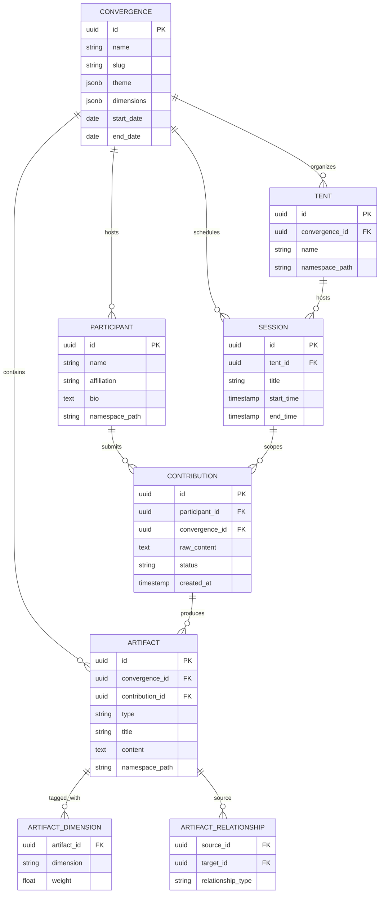

# Schema Architect -- Visual: commons.id Entity-Relationship Model

The core entity model for commons.id mapped to REA ontology, showing how the four namespace types relate and how dimensions attach to artifacts.

