# Technical Lead -- Visual: Seven-Layer Pattern Stack for commons.id

The full commons.id architecture mapped to the Seven Progressive Design Patterns, showing how each layer depends on the layer below and what technology implements it.

```mermaid
graph TB
    subgraph L7["Layer 7: View"]
        V1[React + Vite + Tailwind]
        V2[Live Event Dashboard]
        V3[Knowledge Graph Visualization]
        V4[CI/CD via GitHub Actions]
    end

    subgraph L6["Layer 6: Constraint"]
        C1[Row-Level Security Policies]
        C2[Rate Limiting: 10/IP/hour]
        C3[Auth via Magic Link]
        C4[Content Validation: 20-10k chars]
    end

    subgraph L5["Layer 5: Flow"]
        F1[Contribution Threading]
        F2[Thread Resolution to Artifact]
        F3[Convergence Chain: Append-Only Hash]
        F4[Ebb-Flow Sprint Cycles]
    end

    subgraph L4["Layer 4: Event"]
        E1[Supabase Edge Functions]
        E2[Claude Extraction Pipeline]
        E3[Real-Time Subscriptions]
        E4[Webhook Events]
    end

    subgraph L3["Layer 3: Relationship"]
        R1[REA Ontology: Resource / Event / Agent]
        R2[Artifact Cross-References]
        R3[Participant-Contribution Links]
        R4[Dimension Associations]
    end

    subgraph L2["Layer 2: State"]
        S1[Supabase PostgreSQL]
        S2[Artifacts + Contributions Tables]
        S3[Materialized Views for Counters]
        S4[Full-Text Search Index]
    end

    subgraph L1["Layer 1: Identity"]
        I1[Namespace: /a/ /p/ /c/ /t/]
        I2[UUID Primary Keys]
        I3[e/H-LAM/T/S Dimension Schema]
        I4[Convergence Config Model]
    end

    L7 --> L6 --> L5 --> L4 --> L3 --> L2 --> L1
```

