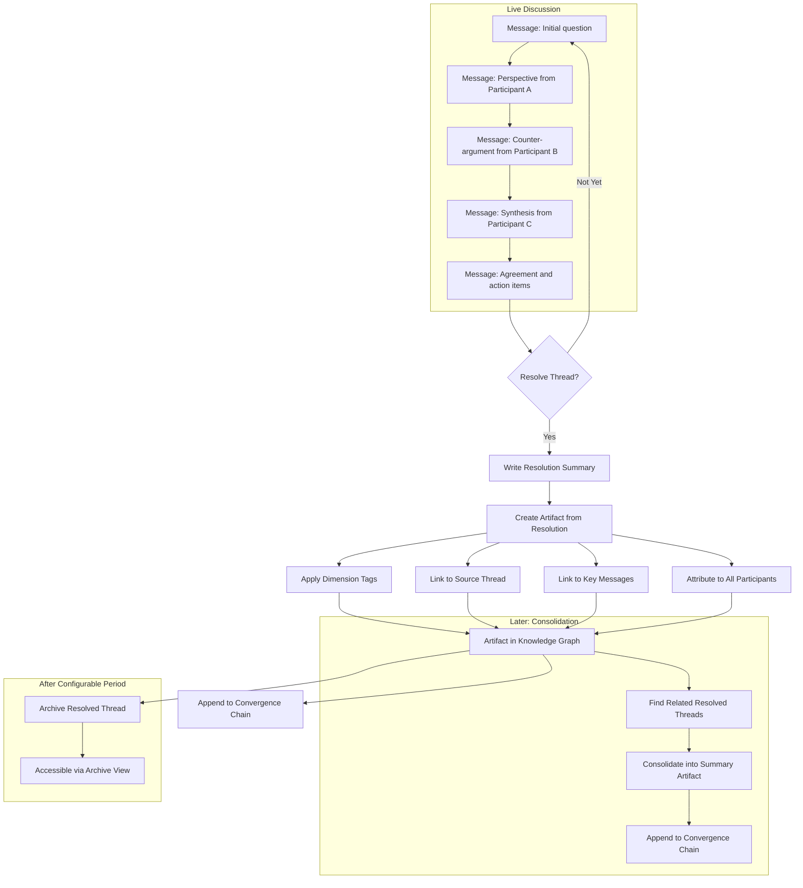

# Workflow Engineer -- Visual: Thread Resolution Workflow

The end-to-end flow from live discussion through thread resolution to knowledge graph artifact, showing how communication becomes structured knowledge.

